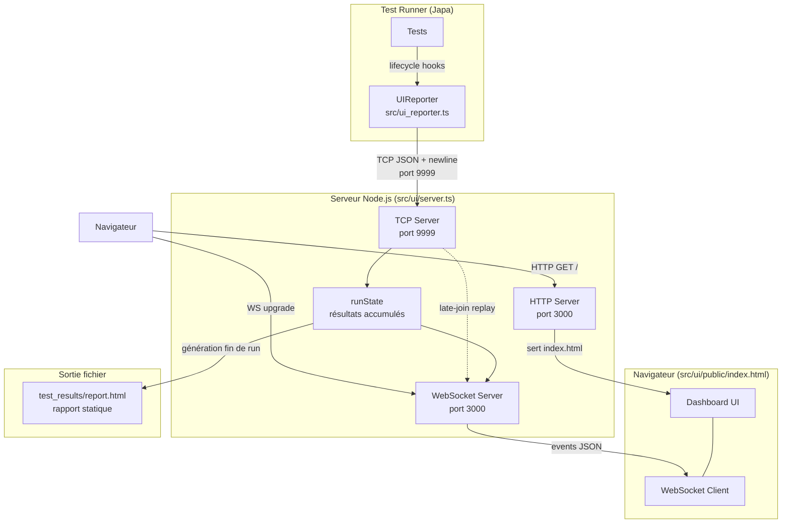
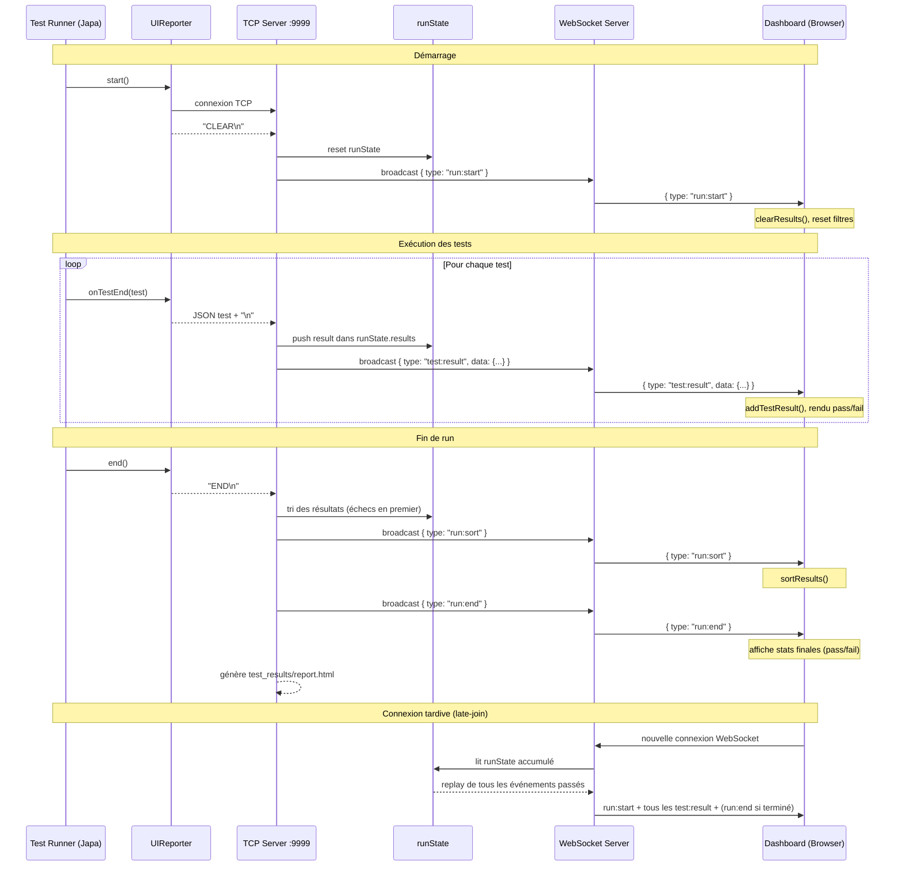

# Architecture — japa-ui-reporter

## Vue d'ensemble des composants



---

## Flux de communication détaillé



---

## Messages TCP (Reporter → Serveur)

| Message | Format | Quand | Effet |
|---------|--------|-------|-------|
| `CLEAR` | Texte brut | Début du run (`onTestStart`) | Reset du dashboard |
| Test result | JSON + `\n` | Fin de chaque test (`onTestEnd`) | Ajout du résultat |
| `END` | Texte brut | Fin du run (`end`) | Tri + rapport HTML |

### Structure d'un résultat de test (TCP → WS)
```json
{
  "title": "nom du test",
  "group": { "title": "nom du groupe" },
  "hasError": false,
  "errors": [],
  "duration": 5.234,
  "file": { "name": "chemin/du/fichier" }
}
```

---

## Events WebSocket (Serveur → Dashboard)

| Event | Payload | Effet dans l'UI |
|-------|---------|-----------------|
| `run:start` | `{ type: "run:start" }` | Vide les résultats, affiche "Running..." |
| `test:result` | `{ type: "test:result", data: {...} }` | Ajoute un test (icône ✓/✗) |
| `run:sort` | `{ type: "run:sort" }` | Trie les groupes et tests (échecs en premier) |
| `run:end` | `{ type: "run:end" }` | Affiche les stats finales, scroll en haut |

---

## Configuration

```ts
UIReporter.ui({
    ui:       { port: 3000 },   // HTTP + WebSocket (défaut: 3000)
    reporter: { port: 9999 },   // TCP (défaut: 9999)
    killPortsInUse: true,       // Tue les processus sur les ports (défaut: true)
    livePreview: true,          // Ouvre le navigateur auto (défaut: true)
})
```

---

## Fichiers clés

| Fichier | Rôle |
|---------|------|
| `src/index.ts` | Point d'entrée, exports |
| `src/handler.ts` | Fonction `ui()` qui instancie UIReporter |
| `src/types.ts` | Interfaces TypeScript |
| `src/ui_reporter.ts` | Classe UIReporter, hooks Japa, client TCP |
| `src/ui/server.ts` | Serveurs TCP + HTTP/WebSocket, routage des messages |
| `src/ui/public/index.html` | Dashboard (HTML + CSS + JS vanilla) |
