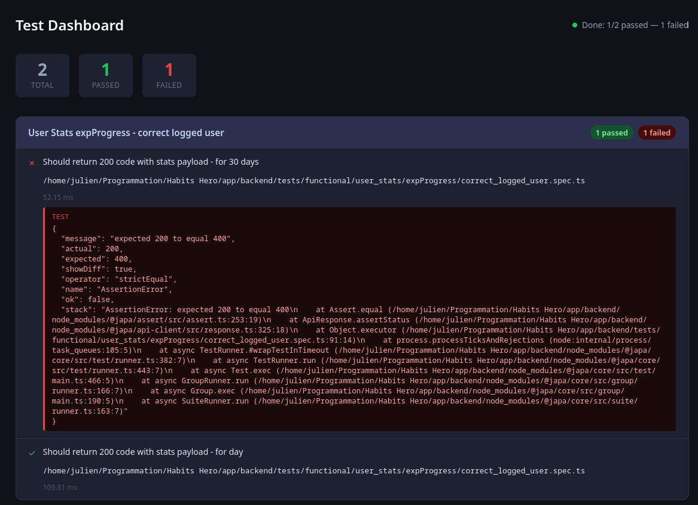

# Japa UI reporter

Frustrated by the various default reporting tools, I created my own.

This one allows you to open a dashboard in your browser with live reports of your tests, similar to `vitest --ui`

When the tests start, a page will open in your browser.



## Installation

```bash
npm install -D @juliendu11/japa-ui-reporter
```

## Usage

:warning: Note: I use it with Adonis JS; it's designed to be used with **version 6**.

```ts
// tests/bootstrap.ts
import UIReporter from '@juliendu11/japa-ui-reporter'

import type {Config} from '@japa/runner/types'

export const reporters: Config['reporters'] = {
    activated: ['ui'],
    list: [UIReporter.ui()],
}
```

### Options

```ts
UIReporter.ui({
    ui: { // Optional, default: {port: 3000}
        port: number
    },
    reporter: { // Optional, default: {port: 9999}
        port: number
    },
    ...BaseReporterOptions // Optional
})
```

## How it works

The reporter starts a server that serves the dashboard and listens for test events. When a test event occurs, it sends
the data to the dashboard via WebSocket, which updates the UI accordingly.